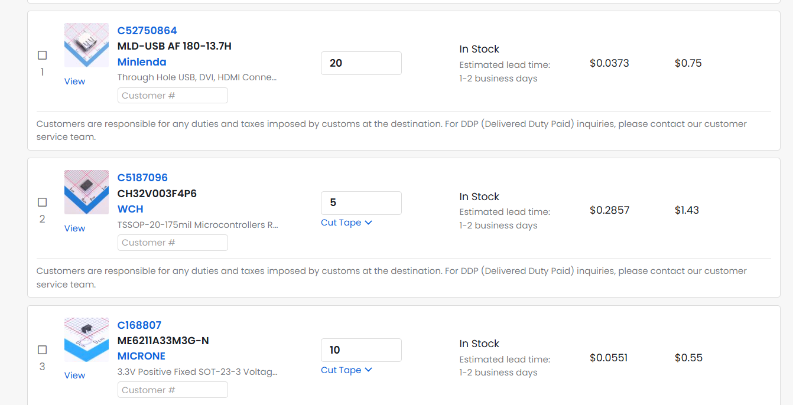
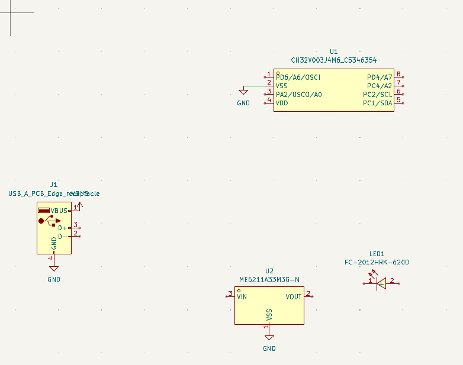
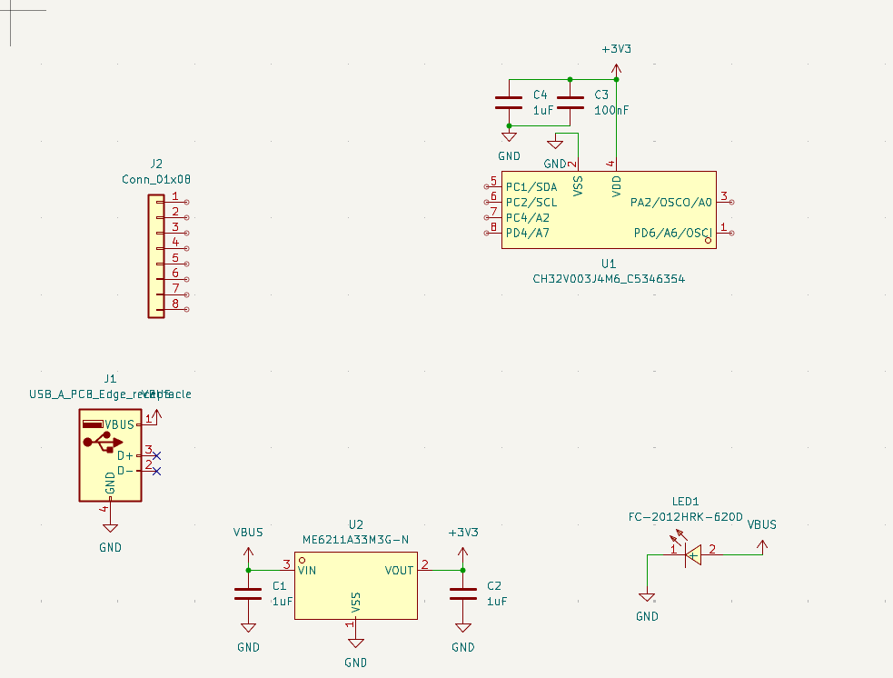
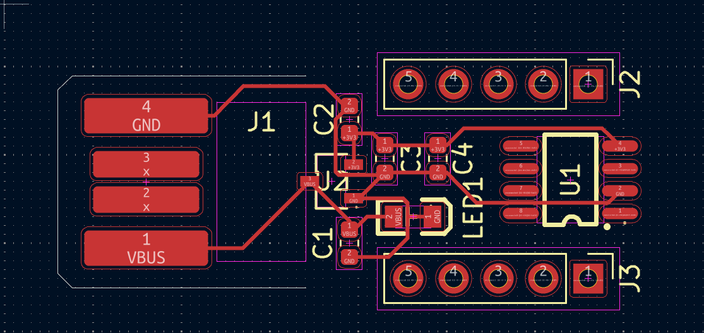
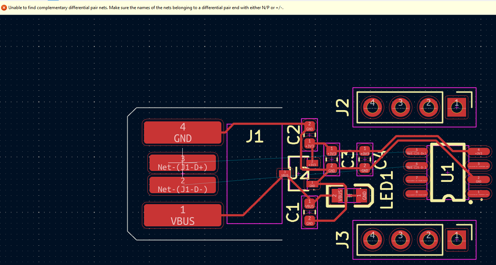
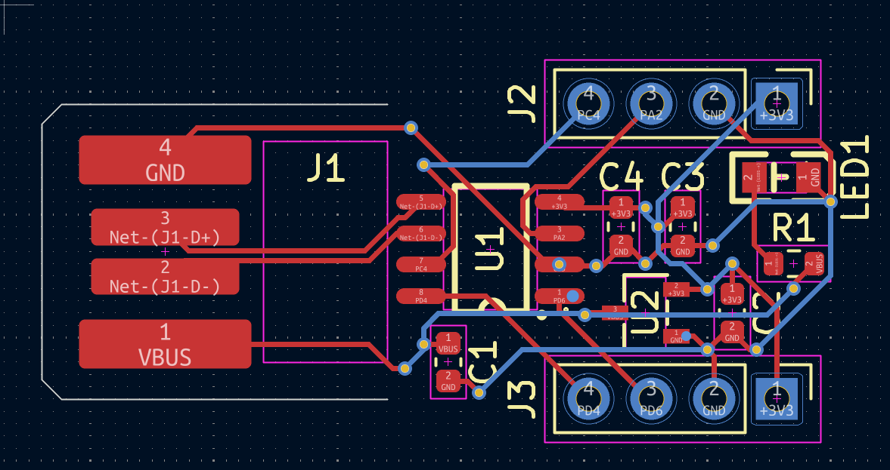
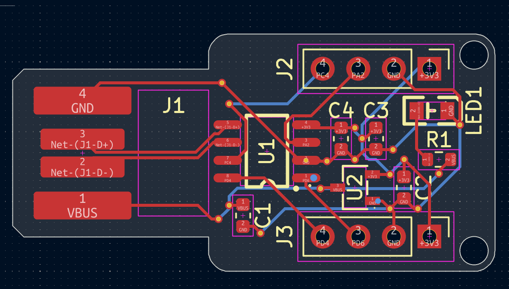

# USB A Mini Devboard

I'm building a small usb a devboard

## 5/12/2026 - Brainstorming and Parts

I originally was going to build a different devboard but realized it would take a way longer time so I pushed it aside for later. Instead I decided to make a small USB A devboard, inspired by the AngstromIO devboard from Blueprint (https://github.com/Dieu-de-l-elec/AngstromIO-devboard). I decided to go with a CH32V003 for my MCU and had discovered the datasheet on LCSC was in Chinese and was going to change to a different devboard but I then discovered the official site of the maker had an english version of it. Along with this thanks to the CH32V003 already having an inbuilt oscilator I didn't have to worry about adding a crystal oscillator. I also am current thinking about trying to place the USB A connector on the backside of the PCB in order to minimize space but if this idea doesn't work (haven't really tried it out yet) I may instead try to turn a part of the pcb into a male connector like how it's done on a picoducky.  

### Time Spent: 0.4 Hours

## 5/13/2026 - Finishing Up Parts And Adding To Schematic

I found all the parts and added them all to the schematic. I changed my mind about using a female connector and decided to use an inbuilt usb a male connector pcb design like how it's done on the picoducky. I ended up deciding to use a CH32V003J4M6 instead of the CH32V003F4P6 since I was going to use a minimal amount of pins so why have a bunch of extra unused ones. I had some issues when it came to importing all of the stuff with easyeda2kicad which is why it took longer than expected. Along with this I just could not find a resource for making the edge connecter other than this 1 video in Hindi. I've decided to move away a bit from the extremely miniature design since after looking back at the Angstrom devboard (time not counted here) I realized it'd take a level of experience that I don't have. I still do aim to minimize size, just not as much anymore.  

### Time Spent: 0.6 Hours

## 5/17/2026 - Finished Schematic and Assigned Footprints

I finished the schematics and added all the footprints. Spent some time deciding if I wanted to use 2 01x04 pin headers but decided on a 1x08 for the sake of simplicity. If necessary I may switch over to a 2 01x04s if it helps minimize space. I had some issues with the footprints I got off github for the PCB edge but I managed to get it working after moving the files around.  

### Time Spent: 0.6 Hours

## 5/18/2026 - Routing
I set up the pcb design and started routing it. It was pretty difficult keeping the silkscreen legible since I was trying to make the devboard remained small since that was my goal with this project. However while working I did realize and issue. This microcontroller had 6 pins that it would be using. While the 1x04s would have an overall of 8 pins, 2 from each set would be used for vbus and ground leading to me having only 4 pins. I ended up changing the 1x04s in 1x05s in order to cover the leftover 6 pins.  

### Time Spent: 0.5 Hours

## 5/18/2026 - Routing Progress

I ended up quickly realizing my mistake from the prior devlog. I had completely forgotten about setting up the data lines between the microcontroller and the data lines of the original PCB. This meant I had to switch back to the 1x04s for the pin headers along with also adding the USB connections in the schematics. I ended up facing an issue with the differential pairs which led to me trying to fix it for a while. I decided to take a break and come back after some time.  

### Time Spent: 0.5 Hours

## 5/18/2026 - Routing Complete

So I ended up coming back after some time and realized my mistake. The error message was quite literally telling me what my issue was, I just couldn't understand what it meant earlier. However now I realized I needed to change the names of the pads on the connections so they would be have the + and - to allow for the differential pair connection to occur. I ended up having to restructure the entire PCB because I couldn't get the differential pairs connections correctly so I moved the MCU to the front and moved all of the resistors and capacitors to the back. Along with this I realized that I had forgotten to add an LED for the resistor and added one to protect the LED from getting fried. I also had to add vias before the +3V3 and GND connections as instructed. All I have left to do is add the mounting holes and actually adding edges.

### Time Spent: 1.7 Hours

## 5/18/2026 - Mounting and Filleting
I ended up realizing that adding screw mounting holes would go against my goal with this project. Instead I ended up making small holes in which a small peg could fit through in order to keep it in place. While this added a millimeter in length I decided it was fine. However I did realize this ended up being 34 mm long, which was was a bit longer than I was hoping for. I did realize the possible reason was caused by the length of the purple square on the usb edge piece (I don't know what exactly they are called). I noticed the fact that other usb edge pieces don't have that and in the future I could possibly remove that. Along with that I could likely be slightly more space efficient in order to get the pcb shorter. In the best case scenario I could even get this under an inch in length. However that would likely be done in a v2 version of this devboard.  

### Time Spent: 0.3 Hours
